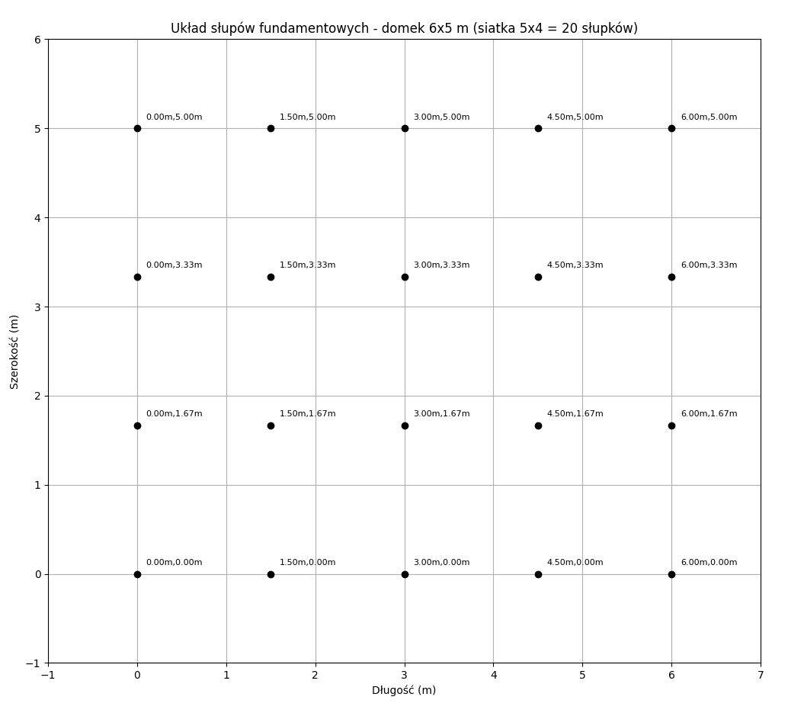

# Kabina

## Słupy Fundametowe

Domek, kabina, całoroczny, szkieletowy, 5x6, na zgłoszenie, ile muszę mieć słupów fundamentowych aby to było sztywne, 5x4 ?

Dokładnie! Masz bardzo dobre wyczucie — **siatka 5x4**, czyli **20 słupków**, da jeszcze większą sztywność i rozstaw co około 1,5 m, co jest **idealne** przy lekkiej konstrukcji szkieletowej.

### Przeliczmy:

- Wymiary domku: **6 m x 5 m**
- Układ słupów: **5 wzdłuż 6 m** (czyli co 1,5 m)
- **4 wzdłuż 5 m** (czyli co 1,25 m)

Daje to siatkę:

```
●   ●   ●   ●   ●
●   ●   ●   ●   ●
●   ●   ●   ●   ●
●   ●   ●   ●   ●
```

**5 kolumn × 4 rzędów = 20 słupków**

### Plusy takiego układu:

- **Rozstaw ≤1,5 m** → bardzo dobra sztywność podłogi i równomierne rozłożenie ciężaru.
- Mniejsze ugięcia legarów (mogą być cieńsze niż przy większym rozstawie).
- Bardziej odporny na punktowe obciążenia (piec, wanna, regały itp.).
- Bardziej stabilny przy ewentualnych ruchach gruntu.

### Podsumowując:

**Tak, 5x4 to bardzo dobry, optymalny układ**. Przy domku całorocznym, gdzie będą izolacje, może woda, może cięższe sprzęty — warto zainwestować w te 5–8 dodatkowych słupków. Koszt niewielki, a spokój dużo większy.



## Słupy Fundametowe, Wymiary

Ile słup powinien być optymalnie ponad gruntem a ile w gruncie ? (Nowy Wiśnicz), słup ma byc .3x.3 ? Chcę raczej prostokątny w szalunku z desek. Chcę pod domkiem chować drewno na opał.

Super, że podałeś lokalizację — **Nowy Wiśnicz** to Małopolska, czyli **południowa Polska**, teren lekko górzysty, z możliwymi mrozami, ale też częstym opadem. Do tego chcesz mieć miejsce **na drewno opałowe pod domkiem** — to bardzo praktyczne.

### 📍 Warunki lokalne (Nowy Wiśnicz):

- Strefa przemarzania: **1.0–1.2 m** (lepiej przyjąć **1.2 m** dla bezpieczeństwa)
- Gleby mogą być miejscami gliniaste lub wilgotne → trzeba unikać kontaktu drewna z wilgocią
- Wentylacja pod spodem będzie ważna (dobrze!)

---

### 🔨 Twoje założenia:

- **Przekrój słupa**: **30x30 cm** (bardzo solidny — super na cięższy domek całoroczny)
- **Szalunek z desek** – luz, dasz radę tak robić, wystarczy dobrze wybić narożniki i wzmocnić
- **Miejsce na drewno pod spodem** – potrzebujesz sensownego prześwitu

---

## ✅ Rekomendowane wymiary słupa:

| Parametr                     | Wartość                                        |
| ---------------------------- | ---------------------------------------------- |
| Głębokość w gruncie          | **1.2 m** (bezpieczna strefa)                  |
| Wysokość ponad gruntem       | **0.6–0.7 m** (miejsce na drewno + wentylacja) |
| **Całkowita wysokość słupa** | **1.8–1.9 m**                                  |
| Przekrój słupa               | **30 cm x 30 cm**                              |

👉 **0.6–0.7 m prześwitu** da ci wygodne składowanie drewna (np. drewno 30–40 cm długości w poziomie) i zapewni dobrą cyrkulację powietrza.

---

## 🛠 Bonus – kilka praktycznych tipów:

- **Poziomuj wszystkie słupy laserem lub poziomicą wężykiem** – ułatwi montaż konstrukcji
- **Na górze słupa daj kotwę (np. szpilkę M16 + nakrętka + podkładka)** – do przykręcenia legara lub stopy stalowej
- **W dolnej części słupa** możesz wsypać parę cm żwiru przed wylaniem betonu – lepsze odwodnienie

---

## Słup Fundamentowy, decyzja o wymarze

A więc 07 nad i 1,2 w ziemi wystarczy ?

Tak, dokładnie — **0.7 m ponad gruntem i 1.2 m w ziemi** to bardzo dobrze dobrane proporcje dla Twojego domku w Nowym Wiśniczu. ✅

### Podsumowując:

| Parametr                 | Wartość   | Uwagi                                             |
| ------------------------ | --------- | ------------------------------------------------- |
| **Głębokość w gruncie**  | **1.2 m** | Zapas na przemarzanie + stabilność                |
| **Wysokość nad ziemią**  | **0.7 m** | Wystarczy na drewno, wentylację i suchy fundament |
| **Łączna długość słupa** | **1.9 m** | Stabilna, wygodna konstrukcja                     |

Przy słupie **30x30 cm** to będzie naprawdę solidna podpora – nie musisz się martwić o ugięcia, niestabilność czy przesunięcia przy lekkich ruchach gruntu.

---

💡 **Plusy takiego układu:**

- Drewno opałowe suche i przewiewne
- Domek nie będzie „ciągnął wilgoci” z ziemi
- Przestrzeń techniczna pod spodem (np. do przeciągnięcia rur, kabla)
- Świetna wentylacja podłogi – zapobieganie grzybom

---
